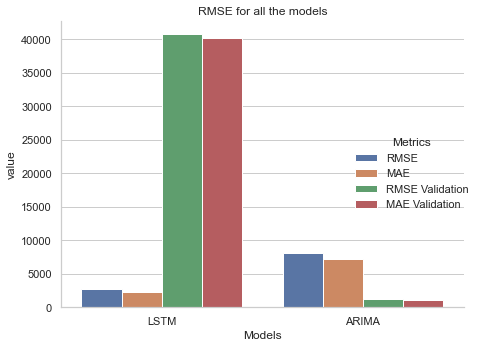
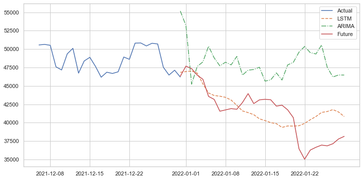

# Initializing Conda environment
Use the environment.yml file to create a replica of the env used to run the notebooks. Or you could use the `requirements.txt` to pip install the modules. 

 Recreating the environment
 ```
 1. conda env create -f environment.yml
 ```

 # File Structure
 ````
 ├───data
│   ├───data-preparation
│   └───datasets
├───models
│   └───saved_models
├───plots
 ````

`data` folder contains the notebooks used to collect and process the data, and all the time series datasets.

`models` folder contains all the notebooks that trained and fit the models (LSTM & ARIMA), inside that the subfolder `saved_models` is where the best models were saved. 

And finally, the `plots` folder simply contains the matplotlib graphs.

# Results

The LSTM model produced an accuracy of 94% when making forecasts, ARIMA performed very poorly when making future forecasts, but excelled in predicting validation data. Below is an image of the metrics for each model.



The plot below shows the predictions made for the future by the models. The red line shows the present  values. 

